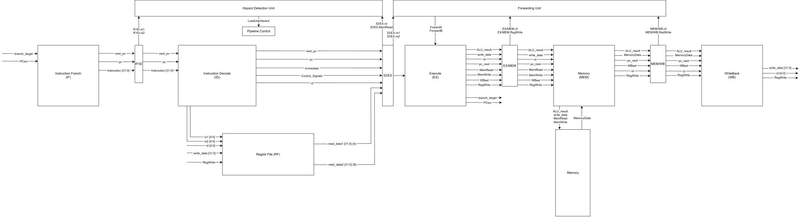
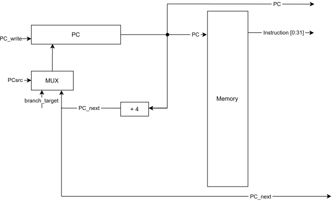
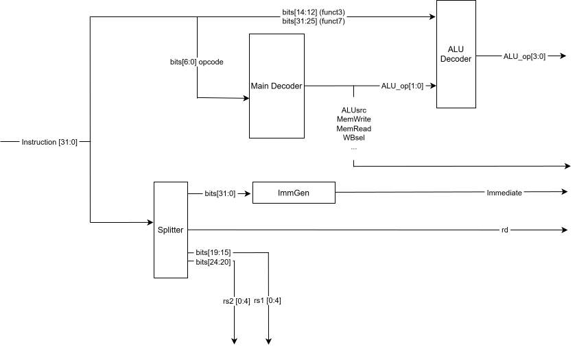
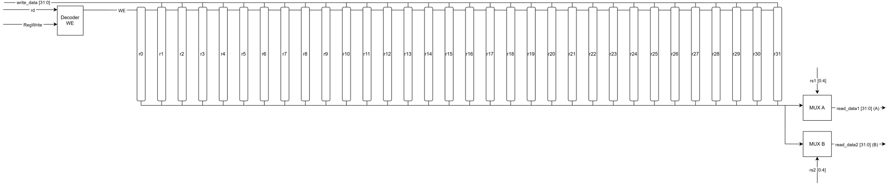
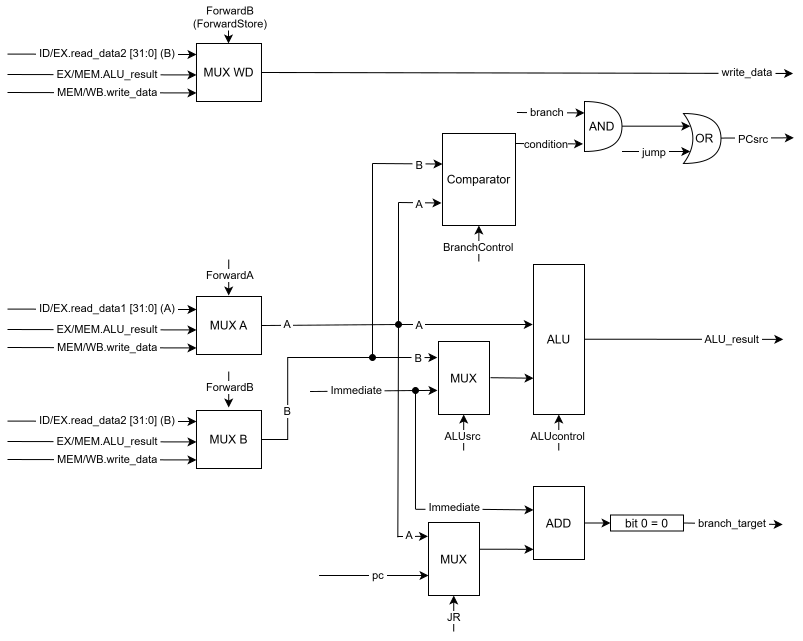
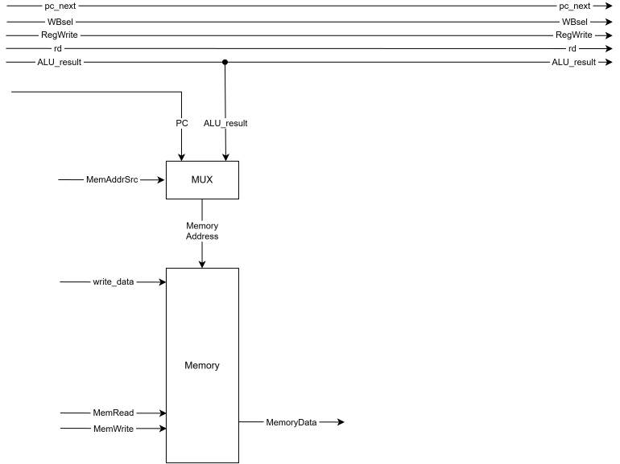
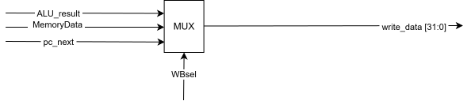
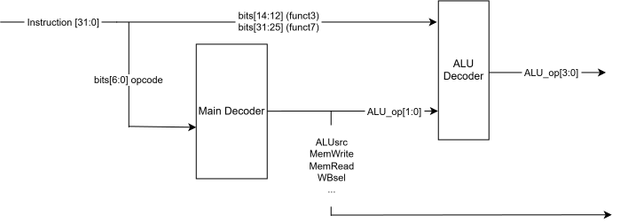
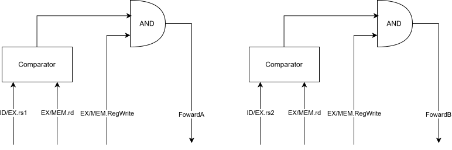

# RISC-IV-32-neumann[-pipeline-5]

### Общая архитектура
--- 

### IF
---

### ID
---

### RF
---

### EX
---

### MEM
---

### WB
---

### Control Unit
---

### Farwarding Unit
---

### Hazars Detection Unit

